Preface
=======

This manual is basically a dump from the cockatrice.de dokuwiki.
Cockatrice has some legal problems right now and the page is down. This
document tries to save the documentation about the software, beautify
and extend it in the future. Please contribute to the project, it is
much too precious to be destroyed.

Getting Started
===============

Making A User Profile
---------------------

Not available anymore, site is down. If someone runs his own server
where you can register a user profile, read his documentation.

Downloading and Installing the Cockatrice Program
-------------------------------------------------

Due to a legal dispute there are currently no official builds left, so
currently you have to build your own binaries.

### Client compilation

#### Windows

There should be two ways to compile Cockatrice: With Visual Studio 2010
and with MinGW. As the Visual Studio method is more complicated and
might not work, you should do it with MinGW. The following howto has
been tested with Windows 7 64Bit.

##### Prerequisites

We need the Cockatrice sourcecode, it’s dependencies and build tools.
Everything is freely available:

1.  MinGW is needed to compile everything, it ships the compiler and
    other tools for this task.

2.  git is needed to download the latest Cockatrice source code.

3.  cmake is needed to create Cockatrice’s project files for MinGW.

4.  Qt 4.8 is a dependency for Cockatrice (download the MinGW version!)

5.  protobuf 2.5 is another dependency for Cockatrice (download the zip
    file with the sourcecode).

6.  Nullsoft Scriptable Install System (NSIS) which can be used to
    create an installer for your own Cockatrice version.

All downloadlinks together:

##### Installation of the Prerequisites

1.  Download MinGW (mingw-get-inst), git, cmake, protobuf 2.5 sources
    zip and Qt 4.8.4 MinGW (see links above).

2.  Make a standard installation for git, cmake and NSIS.

3.  Install MinGW:

    1.  Select default values everywhere, except: Also check the C++
        Compiler, check the MSYS Basis System and MinGW Developer
        Toolkit.

    2.  Append `C:\MinGW\bin` to your PATH variable (google how to do it
        for your Windows version, if you don’t know it). This is very
        important and overseen many times! You can keep the PATH
        configuration dialog open for the next step.

4.  Install Qt, select default values everywhere, ignore the message
    regarding win32.h and append `C:\Qt\4.8.4\bin` to your PATH variable
    like you did for MinGW.

5.  Unpack protobuf-2.5.0.zip in `C:\MinGW\msys\1.0\home\YOURLOGIN`

    1.  Open MinGW Shell, type the following commands exactly:

    2.  `cd protobuf-2.5.0/protobuf-2.5.0`

    3.  `./configure –prefix=‘cd /mingw; pwd -W‘` (these apostrophs are
        backticks and do not forget the dot at the beginning!)

    4.  `make; make install` (this builds and installs protobuf, which
        needs some time)

    5.  Close MinGW Shell

Your system is now able to compile Cockatrice. You do not have to repeat
the process so far ever again.

##### Cockatrice Compilation

1.  Checkout Cockatrice:

    1.  Start Git Bash and type the following command exactly:

    2.  `git clone https://github.com/Daenyth/Cockatrice`

    3.  Close Git Bash

2.  Start CMake (cmake-gui) and do the following:

    1.  Where is the source code: Point to the Cockatrice directory

    2.  Where to build the binaries: Point to the Cockatrice/build
        directory (it doesn’t matter if it exists; if it doesn’t, cmake
        will ask later if it shall create this directory)

    3.  Check Advanced

    4.  Click Configure, choose MinGW, leave the rest default

    5.  An error will occur, set the following:

        -   Set PROTOBUF\_INCLUDE\_DIR to
            C:/MinGW/include/google/protobuf

        -   Set PROTOBUF\_LIBRARY to C:/MinGW/lib/libprotobuf.dll.a

        -   Set PROTOBUF\_LITE\_LIBRARY to
            C:/MinGW/lib/libprotobuf-lite.dll.a

        -   Set PROTOBUF\_PROTOC\_EXECUTABLE to C:/MinGW/bin/protoc.exe

        -   Set PROTOBUF\_PROTOC\_LIBRARY to
            C:/MinGW/lib/libprotoc.dll.a

    6.  Click Configure again, then Generate

    7.  Close CMake

3.  Start cmd.exe (the Windows Command Prompt) and type the following
    commands:

    1.  `cd Cockatrice/build` (this changes to the build directory)

    2.  `make` (this builds everything and might need some time)

Cockatrice has now been downloaded and built for the first time. You do
not have to repeat the process so far ever again.

##### Updating your Cockatrice build

If you just compiled Cockatrice for the first time, you skip this step
obviously. But if you want to update Cockatrice after the source code
changed on github, do it like this:

1.  Start Git Bash and update Cockatrice:

    1.  `git pull origin master`

    2.  `Close Git Bash`

2.  Start cmd.exe, change to Cockatrice/build, type make like you did
    previously.

Cockatrice has now been updated and built. You may repeat this process
every time when the source code changed.

##### Cockatrice installation

To install Cockatrice, you have to create an installer with NSIS now.
Change to the directory `nsis` in the Cockatrice root directory, right
click the cockatrice.nsi file and select `Compile NSIS Script`. The NSIS
program then creates a file called
cockatrice\_win32\_YYYYmmdd\_git-xxxxxxx.exe. This is the complete,
redistributable installer for your Cockatrice build.

Now install Cockatrice by executing the installer. Note: if you
installed MinGW or Qt in other than the default paths, you have to fix
the paths in the cockatrice.nsi file (also if some libraries change);
you can edit this file with a text editor.

##### Create a card database

Start the oracle.exe (the installer does this automatically) and let it
generate a current cards.xml file:

1.  File $\to$ Download Sets Information $\to$ OK (if there are no MtG
    sets listed)

2.  Check All, Start Download

Congratulations, you may now use Cockatrice!

#### Linux and BSD

The following procedures have been tested with Debian Wheezy, Fedora 18
and FreeBSD 9.1. If you use Gentoo with KDE you have the needed
prerequisites and may continue with downloading the source. If you use
Bodhi or Arch Linux (AUR) or another distribution that includes
Cockatrice, you might install Cockatrice from the default packages –
though the package might be old, so you probably should continue with
this howto.

Before you install new software, you should update your system. The
following instructions failed on a fresh installation of Fedora 18 and
FreeBSD 9.1 until the systems were updated.

1.  You need to install the build tools and dependencies. This varies
    between the Linux distributions.

    Debian, Ubuntu and spin-offs
    :   `sudo apt-get install build-essential git libqt4-dev qtmobility-dev libprotobuf-dev protobuf-compiler cmake`

    Fedora
    :   `sudo yum groupinstall "Development Tools" yum install qt-devel qt-mobility-devel protobuf-devel protobuf-compiler cmake`

    FreeBSD
    :   `pkg_add -r qt4 qt4-linguist qt4-moc qt4-qmake qt4-rcc qt4-uic git cmake protobuf`

2.  Download the sources from github via\
    `cd git clone https://github.com/Daenyth/Cockatrice.git`

3.  To compile the sources, change into the newly created directory,
    create a build directory and invoke cmake:\
    `cd Cockatrice mkdir build cd build cmake .. make`\
    If you have some issues with pthread\_ add ’pthread’ to the
    “target\_link\_libraries” entry in the `CMakeFiles.txt` in
    `Cockatrice/common`.

4.  You may install the program into the directory `/usr/local` by
    typing `sudo make install` but you should also be able to start
    cockatrice and the oracle from the build directory.

5.  Before you start Cockatrice for the first time, run `oracle -dlsets`
    and download available cards, denn run `cockatrice`. The default
    paths for decks, pics, cards and tokens are located in\
    `/home/<user>/.local/share/data/Cockatrice/Cockatrice`.

#### MacOS X

TODO, please contribute this section! See Linux section, then use the
`prepareMacRelease.sh` script from Cockatrice.

### Server compilation

You don’t need your own server if you plan to play only. But as
Cockatrice is open source you are free to run your own. The compilation
works like already written above, but instead of invoking `cmake ..`,
you have to do it like this:

-   If you want to build the server, use:\
    `cmake -DWITH_SERVER=1 ..`

-   If you want to build the server, but not the client, use:\
    `cmake -DWITH_SERVER=1 -DWITHOUT_CLIENT=1 ..`

There is more information on compiling and running Servatrice on CentOS
6 in chapter [servatrice] on page .

Downloading Card Database Using the Oracle
------------------------------------------

If you are installing Cockatrice for the first time, changing what sets
are in your database or even adding the newest set to your database,
this tutorial will show you how to do it properly.

The Oracle will automatically run after the initial setup of Cockatrice.
If you would like to re-install your database or add new sets you can
find it (for Windows) by clicking the start menu, going to all programs,
selecting the Cockatrice folder, and in there you will find the Oracle
tool.

-   When the Oracle importer opens, click on “File” in the top left
    corner and select “Download sets information…”

    

-   This will bring up a box where you can input the URL of a card
    database. The default address is
    <http://www.cockatrice.de/files/sets.xml> this was an XML file found
    on the Cockatrice website that has the current set listings for
    Magic the Gathering. As the page is down, you have to import the
    file which is distributed with the Cockatrice sources. This can also
    be done from the file menu.

-   Select “OK” to load the set listings.

-   A list of all current sets will be brought up. A default selection
    of sets will automatically be checked. From here you can check or
    uncheck all sets, or you may only download specific sets that you
    wish to play with.

    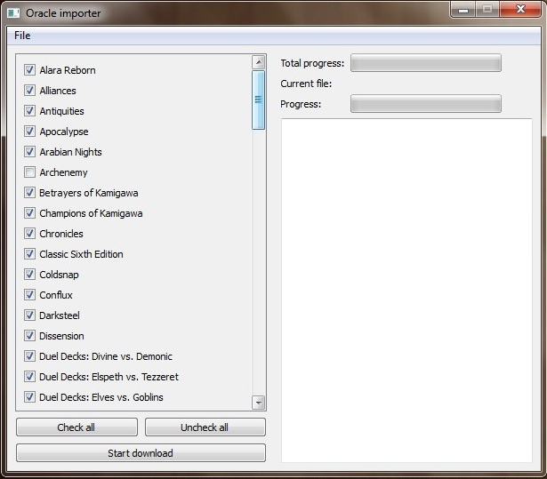

    NOTE: If you are playing against someone who is using a card that is
    not in your database, you will not see a card image or oracle text
    for that card. Some players like to download all sets to avoid this
    issue, but other players who only play specific formats (Like T2,
    Standard, or Extended) wish to keep their database small with only
    cards they will be using.

-   After you select which sets you wish to download, select “Start
    download” at the bottom of the Oracle to download the selected sets
    information.

-   After download is complete, close the Oracle and run Cockatrice.

-   We are now ready to sort our set information in our deck editor.

Editing Set Order and Preference of Card Art
--------------------------------------------

Many cards have been re-printed in different sets, and in return have
different versions of artwork (like the card “Cancel” which can be found
in many sets, but has different artwork for each, e.g. Zendikar versus
M11:

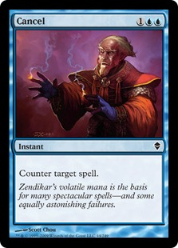 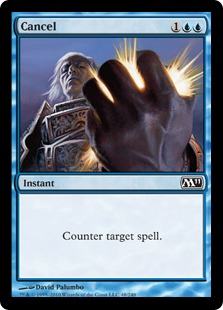

Some players like to have the most current artwork displayed on their
cards, while other players have a favorite set they wish to display
instead.

-   Run Cockatrice and select “Deck editor” from the top right
    Cockatrice menu. This will bring up the Deck Editor along with a
    list of all cards that are currently in your database which you
    downloaded using the Oracle Tool.

-   To change what version of the cards will be shown, click on “Card
    database” on the top left of the Deck editor window, and select
    “Edit sets…”

    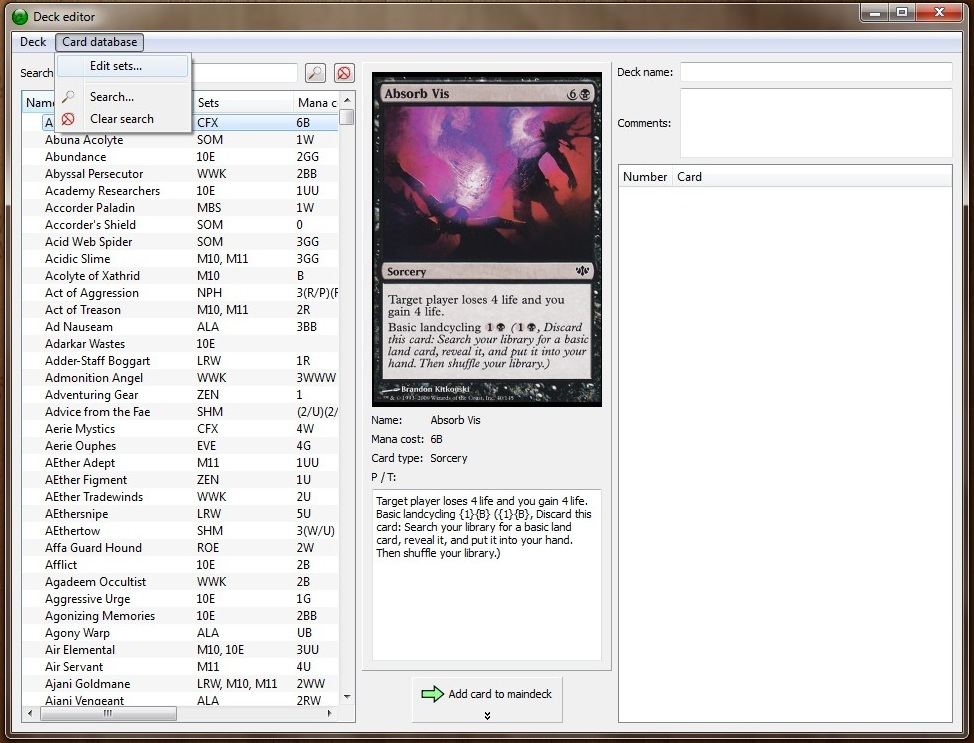

-   This will bring up a new window that has a list of all sets you
    currently have downloaded to your database. To change the order of
    the sets, simply drag and drop them into place. This will determine
    which artwork is shown for your cards. If a card is found in
    multiple sets, whichever set is closest to the top of this list will
    be the art displayed. Example: If M11 is above Zendikar, The M11
    version of the card “Cancel” will be displayed in your Deck editor
    and Cockatrice games.

NOTE: Your opponent will NOT see what artwork you have selected for each
of your cards. They will only see what they have selected for their own.

The Deck Editor / Making a Deck
-------------------------------

The Cockatrice Deck Editor is a tool you can use to make decks to play
online. The cards shown in the Deck Editor are from a database that you
downloaded with the Oracle Tool. If you are missing cards or a new set
has come out, you must re-run the Oracle and download set information.

1. Search Bar
:   The search bar lets you type in the name of a card and the editor
    will only show cards that start with whatever you typed in. Example:
    Typing in ‘B’ will show all cards that start with the letter ‘B’ and
    typing in ‘Dark’ will show you all cards that start with ‘Dark’ and
    so on. If you were looking for the card “Sun Titan”, you would not
    type in ‘Titan’ you would have to type in ‘Sun’ first. Typing in
    ‘Titan’ will only show you any cards that start with ‘Titan’.

2. Card Search/Filter
:   The Card search button will bring up a new window that helps you
    filter out cards more specifically. A variety of check boxes will
    help find what you need. Card name lets you filter out only cards
    that have a cretin word in them. Card text can help you find key
    words like “Haste” or “Infect”. If you were to uncheck all boxes
    except for “Instant” along with “Artifact” and “U”, the Deck editor
    will only show you all Blue Instant and Artifact cards.

    ll Letter & Card Type\
    U & Blue\
    W & White\
    X & Colorless\
    G & Green\
    R & Red\
    B & Black\

3. Card Data
:   This section shows the Oracle text for the card that you currently
    have selected. It will show you up-to-date information on the card
    such as the Name, Mana cost, Card type, Power/Toughness, and any
    abilities the card has. It will not show you flavor text.

4. Adding/Removing Card Buttons
:   The buttons in the bottom middle will add or remove cards from your
    Deck List, as well as ad a card specifically to your Sideboard.
    Having a card selected on the left column and hitting the Enter key
    will also add it to your deck list.

5. Deck Name/Comments
:   The area in the top right lets you name your deck as well as give
    any comments or descriptions such as how to play the deck, where the
    deck came from, or explain a theme. Putting something in the “Deck
    Name” space will NOT be what the file name of the file for your
    deck. That is spate in the “save” selection under the “Deck” menu
    found at the top left of the Deck Editor window.

6. Main Deck List
:   This area will show you what cards you currently have added to your
    deck list. It is sorted by card type and also shows you how many of
    each card and card type you have added, as well as keeps track of
    how many total cards you have added to your main deck list. This
    will not add any number of cards you have added to your Sideboard.

7. Sideboard List
:   The bottom section of the deck list shows any cards you have added
    to your sideboard. Again these are split into card types and it will
    keep track of how many of each card you have as well as how many of
    each card type and total cards in sideboard. This section will not
    add any cards from the main deck. Once you have all of your cards
    added to your deck, you must save it as a file Cockatrice can read.
    Select “Deck” from the top left corner of the Deck Editor screen,
    and select “Save Deck” or “Save Deck As…” and it will bring up a new
    window where you can select where you would like to save your deck,
    as well as assign it a file name. Cockatrice decks are saved as .cod
    files.

Loading a deck list from your clipboard
---------------------------------------

If you find a deck online, or you have a deck list saved in a word
document, it is easy to transfer it over into a Cockatrice deck file as
long as it is in a simple deck list format. The simple deck list format
is a list where each line begins with a number, followed by a
whitespace, followed by the cardname, e.g.

    2 Doom Blade
    13 Island
    10 Swamp
    4 Cancel
    ...

Simply find the word document or deck list online that you wish to save
as a deck, and select the text and copy it to your clipboard. Next, open
the Deck Editor screen, and click on the Deck menu from the top left
corner. Select “Load deck from clipboard…” and the deck editor will
bring up a new window that has the deck list you had copied to your
clipboard. Make sure the Deck list looks correct and hit “OK” in the
bottom right corner of the window. The Deck editor will now add all the
cards in the list to your main deck list.

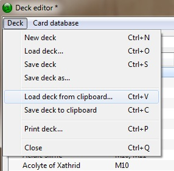

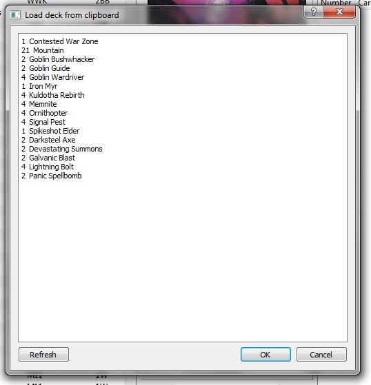

NOTE: If you add a card to a deck list with this function that you do
not have downloaded to your personal cockatrice database though the
Oracle tool, the card will take a spot in your main deck list, and count
toward the total number of cards, but it will show up as a blank image
with no Oracle data or card information.

Cockatrice Settings
-------------------

TODO

Learning the Ropes / Starting a Solitaire Game
----------------------------------------------

The best way to get familiar with the way Cockatrice plays is to start a
local game that you can play around in by yourself. You could also jump
online and start slowly learning, and let other players help you.

To start a Solo Local game, in the main Cockatrice window, click on
“Cockatrice” on the top left, and select “Start local game…”.

This will bring up a small window that lets you select how many players
will be in this local game you are creating. For right now, since we
want to do a solo Solitaire game, select one player and hit “OK”.

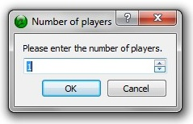

### Loading a Deck / Using Sideboard

This will now bring you to a screen where you load a deck to play with.
On the top left part of this screen you will find a button that is
labeled “Load Local Deck”. Click that button and it will bring up a
window where you can find and select what deck you would like to play
with.

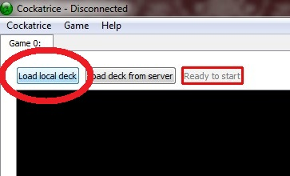 

Select a deck or a .cod file and click “Open”.

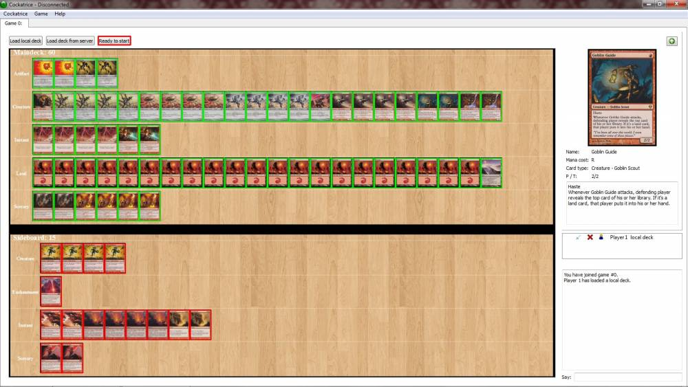

After the file has loaded you will see all of the cards in that deck
laid out on the table. If you hover your mouse over a card, the card
image and Oracle info will show on the right side of the screen. If you
have a sideboard made for the deck there will be a second section on the
table for this sideboard. This screen gives you the ability to double
check your deck to make sure it is not only the correct deck you want to
play with, but it lets you see that all card images have downloaded
properly. If you have cards not showing up at all or they are just blank
cards with names on them, you may not have that set downloaded with your
Oracle tool. If you have a sideboard, you can drag and drop cards from
your main deck to your sideboard or vice-versa. You can do this by
clicking and dragging a card to or from your main deck or sideboard.

NOTE: Moving cards from your main deck to sideboard will NOT change how
your deck file is saved, it will only change it temporary for the game
you are playing or until you load a new deck.

When you are satisfied with your deck choice and/or sideboarding
options, click on the red outlined “Ready to start” button found a the
top of the screen.

### Finding Your Way Around

The main game screenlooks like this

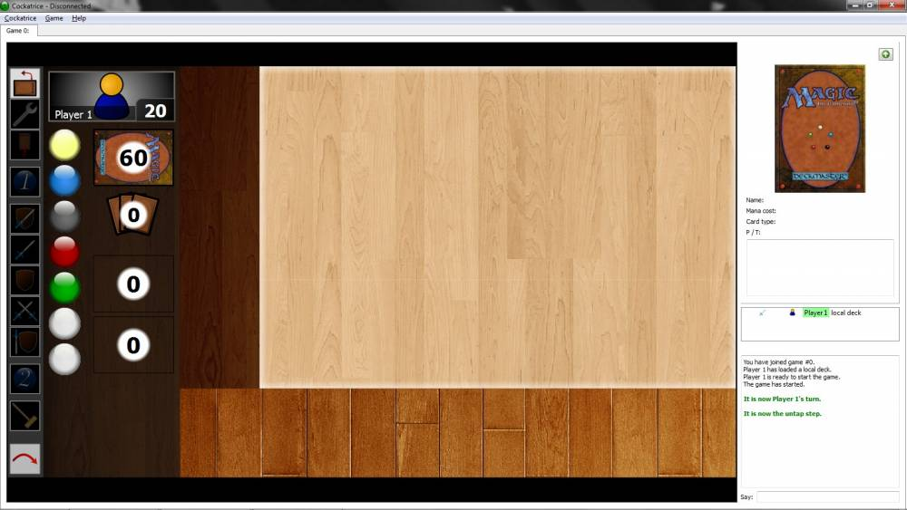

(Please note your screen will look different due to background image
options.)

#### Main Table / Play area

Split into four areas, this is where all the action will go down.

The Stack
:   The area on the left side of the table where Instant and Sorcery
    cards will be played. This is for things that will only temporarily
    be put on the table, then into the graveyard. Multiple cards may be
    added to this area at the same time. Anything on this part of the
    table will be seen by all players.

Battlefield
:   This is the soul part of the game table. this is where creatures,
    enchantments, artifacts, and even plainswalkers will be placed. As
    cards are moved from your had to the table, they will be aligned to
    an invisible grid and moved around from there. Tap cards by double
    clicking them. Anything on this part of the table will be seen by
    all players.

Land
:   This space is for land cards, but any card may be placed here. Tap
    cards here by double clicking them. Anything on this part of the
    table will be seen by all players.

Hand
:   Every time you draw a card it will go here to your hand. You may
    also drag cards from the table back to your hand. Your opponents can
    not see what is in your hand.

#### Player Info Section

Player Avatar
:   This is a $156\times 60$ pixel JPG image that can be uploaded though
    the main Cockatrice website. All players in the game room can see
    this image. It serves nothing more than an online identity for you
    and other players.

Player Name
:   Your online name that you picked though the main Cockatrice website.

Life Total
:   Your in-game life. Using your mouse, if left-clicked will raise this
    number by one, and if right-clicked lowered by one. There are also
    keyboard shortcuts to change your life total.

Counters
:   These seven multicolored circles are used as counters. They can be
    seen by all players and can be changed by left or right clicking on
    them to add or subtract a number. Players use them for various digit
    counting but primarily used for adding and subtracting floating mana
    produced by card effects. The bottom two white counters can be used
    for other things like Poison.

Library
:   This is your deck of cards. The number in the middle reflects how
    many cards are left in your library. Double clicking the deck lets
    you draw a card and add it to your hand, you can also drag cards off
    the top into the battlefield or to your hand. Right-clicking the
    deck brings up a menu that allows other things to happen like
    reviling the top number of cards, shuffling, or moving cards
    directly into the graveyard.

Number of cards in hand
:   The number in the middle represents how many cards are currently in
    your hand. Other players can see this number but can not see the
    cards actually in your hand.

Graveyard
:   Cards can be dragged and dropped into your graveyard from play or
    vise-versa, the stack, your hand, or even your library. The number
    in the middle represents how many cards are currently in your
    graveyard. Any player may right-click on the graveyard and bring up
    a menu that shows what cards are in it.

Exile
:   Cards can be dragged and dropped into exile from play or vise-versa,
    the stack, your hand, or even your library. The number in the middle
    represents how many cards are currently in your exile. Any player
    may right-click on the exile and bring up a menu that shows what
    cards are in it.

#### Turn Phases

This bar located on the left most side of the screen represents the 11
steps in a players turn. To go from one phase to the next, you can click
on the square of the phase you want to move to, or you can hit
Ctrl+space to move down to the next. Some phases even have their own
keyboard shortcut. Going from one phase to the next does not actually do
anything to your or your cards, it is only a place marker for your
opponents to see and keep up with what you are doing in your turn. For
example, clicking to the “Draw Phase” will not automatically draw you a
card. It is customary for a player to end their turn on the “End of turn
step” and let their opponent hit the “next turn” button. This is a
courtesy for other players if they wish to do something like use an
instant at the end of your turn, or in response to something you did.

NOTE: Players sometimes use the term EOT which stands for “End Of Turn”.
This is to let other players know they are doing something in response
to the end of the current turn.

#### Info/Chat Bar

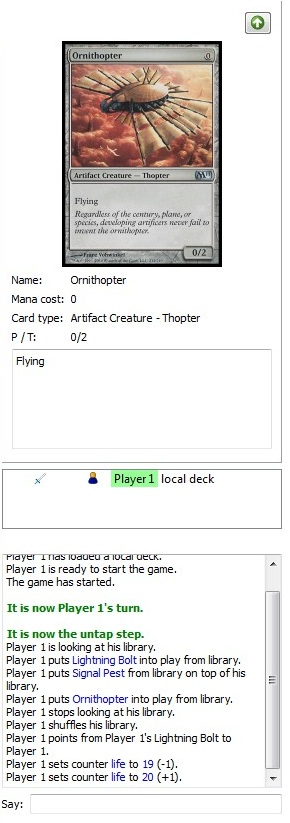

Split into three sections, the Info/Chat bar lets you see a close-up
image of the card your mouse was last over, as well as gives you the
card info for that card. At the bottom of this bar there is a chat log
that helps keep track of events during the game as well as lets you
communicate with other players. if a card is placed on the table,
pointed at, or tapped it will get noted in the chat log as well as has a
link to the card that you can hover over and see an image of at the top
of the bar.

### Basic Functions

#### Rolling Dice

At the beginning of a game players decide who is going first by rolling
a 20 sided die. In Cockatrice we do this by pressing Ctrl-I and hitting
enter. Hitting Ctrl-I brings up a die window and lets you select how
many sides you want on your die. Default is 20, and pressing enter will
“roll” the die. This action will show up in the cat log at on the bottom
right of the screen. You can also find this in the “game” menu at the
top of the window, selecting “player” and clicking on “roll die…”

#### Draw Cards / Mulligan

When a game starts and the first player has been selected, all players
will draw seven cards. this can be done by pressing Ctrl-M. Seven cards
will go from your library to your hand. Pressing Ctrl-M again will put
the seven cards from your hand back into your library, shuffle your
library and deal out six new cards to you. Each time you press Ctrl-M it
will give you one less card until you get down to one card, then it will
re-start at seven cards. This function can be found by clicking the
“game” menu on the top of the window, selecting “player” then selecting
“hand” and then “take Mulligan”. If you are playing a friendly game,
press Ctrl-M as normal, but then press Ctrl-D to draw cards until you
have a total of seven again.

#### Tapping

Tapping cards is very basic. If a card is on the table under your
control, you can double click it to tap it and then double click again
to untap it. You can select multiple cards on the table by clicking and
dragging your mouse, then tap or untap all of the selected cards at the
same time. Other players can not tap or untap your cards. Pressing
Ctrl-U will untap everything you control.

-   Untapped

    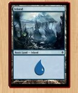

-   Tapped

    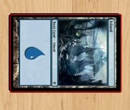

#### Attaching Cards to Cards

Sometimes an Enchantment -Aura or Equipment cards need to be attached to
other cards that are already on the table. simply put the enchantment or
equipment on the table. Right-click the card and select “attach” (this
can also be done with Ctrl-A). A green arrow will appear, point and
click on the card you wish to attach. You can also attach cards to other
people’s cards.

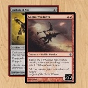

#### Changing Power/Toughness

Enchantments, Equipment, and other effects sometimes change a creatures
power or toughness. This can be done by right-clicking the card, and
selecting “power / toughness” then selecting which one you wish to do.
Other players can not change your creatures power and toughness. This
can also be done though a series of keyboard shortcuts seen below.

  -------------------------- ------------------------------
  (Select card) Ctrl++       Increase power
  (Select card) Ctrl+-       Decrease power
  (Select card) Alt++        Increase toughness
  (Select card) Alt+-        Decrease toughness
  (Select card) Ctrl+Alt++   Increase power and toughness
  (Select card) Ctrl+Alt+-   Decrease power and toughness
  -------------------------- ------------------------------

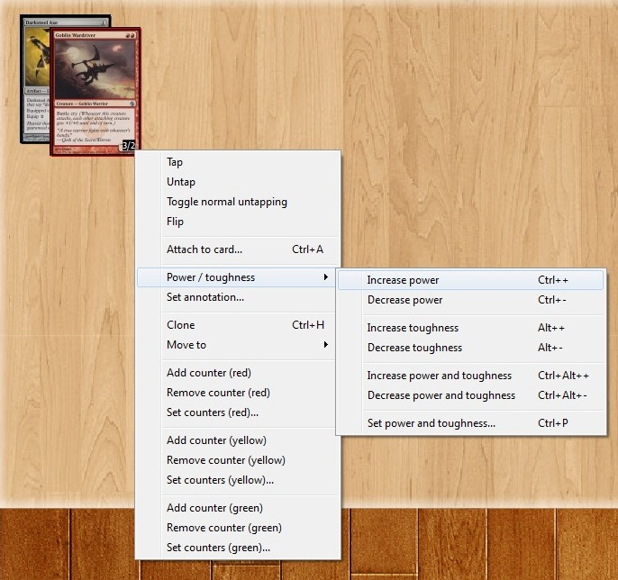

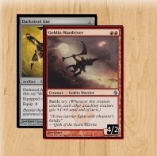

#### Adding Counters to Cards

Sometimes Counters are needed to be placed on cards that the counters on
the side of the screen are not able to track. Cockatrice offers three
different counter color options, Red, Green, and Yellow. Although there
is no set standard on what color stands for what, it is mostly player
preference. Green could be used for +1/+1, red -1/-1, leaving yellow for
charge and quest counters, this is not a set rule. Adding counters is as
simple as right clicking on the card you wish to add counters too, and
currently there is no keyboard shortcut for this process. Removing
counters is the same process, right click and select remove. Other
players can not add or remove counters to or from your cards.

(One of each counter)

#### Pointing at Cards / Arrows

Pointing at cars is needed for resolving spells, or declaring attackers
and blockers. All you need to do is right-click over a card and drag an
arrow over to what you are pointing at. Permanents, spells in the stack,
and even a players life total can be pointed at. You can point at your
opponents cards and life total, and they can point at yours. When your
arrows are no loner needed, press Ctrl-R to remove them from the screen.

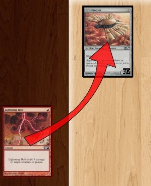

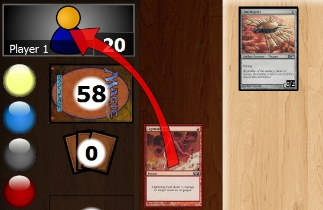

#### Creating Tokens

Creating tokens can sometimes be tedious, but is well worth the effort
to keep a clean and organized game. Pressing Ctrl-T will bring up a
small window to assist you in creating a token. Simply enter the name of
the token you are creating, select its color, and give it a power and
toughness (\#/\#). You can also bring up this token window by selecting
“game” from the top menu, selecting “Player” then clicking on “Create
Token…”. A copy of the Last token made can be done by pressing \*Ctrl+G
or right-clicking on a already made token (or any card on the table) and
selecting “clone” or pressing Ctrl-H\*\*. When a token or clone leaves
play, it will be destroyed and vanish.

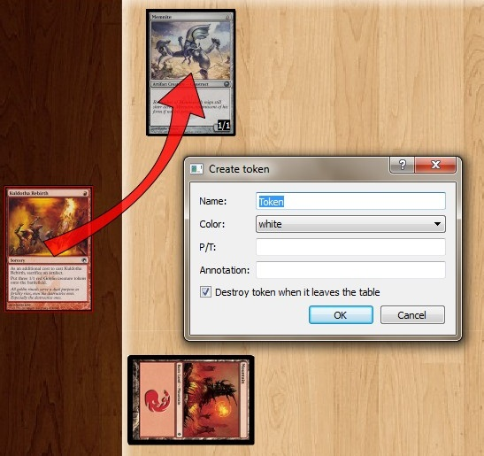

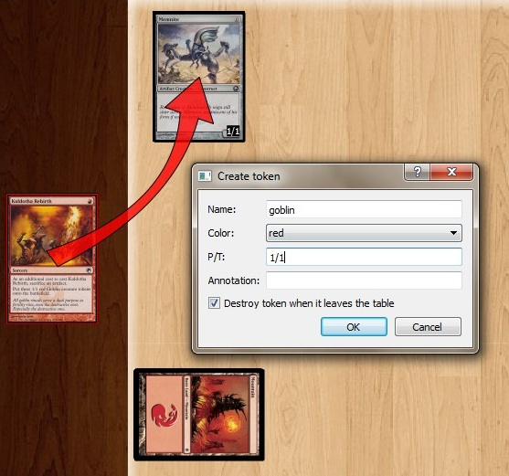

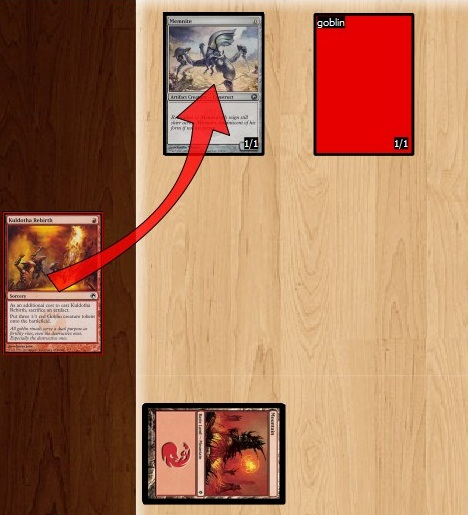

Make copies of your last token by pressing Ctrl-G.

Playing Online
==============

With Cockatrice you will most likely play Magic games over the Internet
with real people all around the world. In order to help maintain a
pleasant environment for users, please read the messages below:

-   User Code of Conduct[^1] – Must Read for all Users

-   How to Report Abuse[^2] – It is recommended to read this as well

Connect to Server
-----------------

To connect to the Cockatrice server, launch the Cockatrice program, go
to the “Cockatrice” menu at the top left, and select “Connect”. A window
will appear (see image below).

If you have registered with Cockatrice, then enter your Username in the
“Player Name” field and your password in the “Password” field then click
“OK”. You may check the “Remember Password” box if you wish. If you do,
then the next time “Connect” is selected from the “Cockatrice” menu, the
window that appears will already have your Username and Password already
filled. Please take this into consideration if you share a computer with
other people, seeing that you are responsible for anything that happens
on the server with your username (As noted here). If you did not
register with Cockatrice, then simply fill in the Username with whatever
you like and click “OK”. If you would like to become a registered user,
read the instructions from the server’s website.

Once you are connected to the server, more tabs will appear at the top
of the screen next to the “Deck” tab that you are already on.

All About Games
---------------

This page is about creating, joining, watching, and searching for games
on the Cockatrice Server. In order to participate in any games, you have
to be connected to the server. The games on the server are where all of
the action take place. There will be many games happening on the server
at the same time. Basically, first a game is created by a player (it
could be you). Then other players join the game until the number of
players reaches the number set by that game’s creator. When the game has
no players participating in it, the game disappears. Creating a Game

To Create a game, go to the “MTG room” tab. Click on the “Create” button
below the Games list. A window will appear (see below).

Here are all of the options for creating a game:

Description
:   Describe the game in your own words (i.e. “Competitive Standard”,
    “Casual EDH- No Infinites”, “RavnicaDraft”, “Here is Chris”)

Players
:   Specify the number of Players in the game. This cannot be changed
    after the game is created. The game can only begin when the
    specified number of players join.

Spectators
:   Spectators are users that are in a game, but they are not one of the
    players. Spectators can see all of the public zones of the game and
    everything displayed in the Info/Chat Bar. Any number of users can
    join a game as a Spectator (as long as the “Spectators Allowed” box
    is checked).

    Spectators Allowed
    :   Unchecking this box will prohibit any/all users from joining the
        game as a Spectator.

    Spectators Need a Password to Join
    :   Checking this box will make it so that in order for a user to
        join as a Spectator, they need to type the password you specify
        in the Password Field.

    Spectators can Chat
    :   Checking this box will allow Spectators to type comments in the
        Chat bar during the game.

    Spectators See Everything
    :   Checking this box will allow Spectators to view cards in all
        private zones of all players (hands, libraries, face-down
        cards).

Password Field
:   If you type anything in this field, a Player (or Spectator if the
    “Spectators Need Password” box is checked) will need to type the
    exact same thing you typed in order to join the game (and it is
    case-sensitive).

Only Buddies Can Join
:   Checking this box will prevent any user who is not in your Buddy
    List from joining the game as a Player or Spectator. NOTE: Your
    username is not on your buddy list. If you leave a game you created,
    and this box is checked, you will not be able to rejoin.

Only Registered Users Can Join
:   Checking this box will prevent anyone who has not registered on the
    Cockatrice website from joining as a Player or Spectator.

Game Type
:   These check boxes have no effect on the game. They inform other
    Users browsing the Games list of what format your game is. Users can
    choose to view only games of a certain Type/Format.
    (<http://en.wikipedia.org/wiki/Magic:_The_Gathering_formats>)

### Joining a Game

Most of the time, to join a game you click on the “MTG Room” tab, click
on a game in the Games list, then click Join. If the Game’s creator
specified a password then you will have to type that password in a small
window that appears after you click Join (the password is
case-sensitive). If your User Profile meets the criteria of the Game’s
creator then a new tab will open with that game. There is also an easy
way to join a game in which a User in your Buddy List is playing. Go to
the “User Lists” tab, right click any Username from the Buddies Online
list (at the left of the window) to make a menu appear, and select “Show
this user’s games”. A window will open with a list of games that the
User is either playing or watching. In the same manner as described with
the “MTG Room” tab, simply click on a game and click Join. To watch a
game, the instructions are the same except that you click the “Join as
Spectator” button instead of the Join button. NOTE: If you are a player
in a game and you wish to become a spectator in that game, you must
first leave the game then rejoin as a Spectator. Same thing if you are a
Spectator and wish to play.

### Searching for Games

The Games list in the “MTG Room” tab displays by default all games that
have not reached the specified number of players. The “Filter Games”
button makes looking through this list easier if you are looking to join
a particular kind of game. When this button is selected, a window
appears (see below).

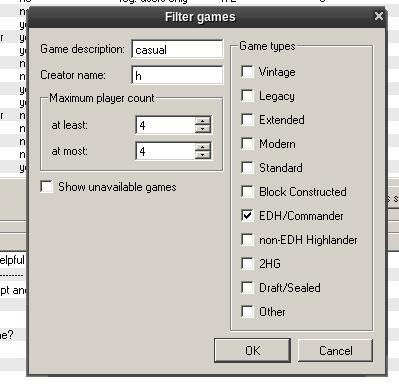

Game Description
:   Displays games with certain descriptions. You can even search
    partial names.

Creator
:   Displays games created by Users with that username. It even searches
    for partial names.

Player Count
:   Displays all games where the specified number of players is
    greater-than or equal to the “at least” number and less-than or
    equal to the “at most” number. For instance, setting both numbers to
    3 will display all games whose creators made as 3-player games.

Show Unavailable Games
:   Checking this box will display games that are full and in progress.
    You can still join these games as a Spectator if the game’s creator
    allows it.

Game Types
:   Displays games with the selected types. Bear in mind that the
    Cockatrice software does not enforce deck construction for formats.
    So just because a game’s type is EDH/Commander, doesn’t necessarily
    mean that is what’s being played in the game. Players can agree to
    switch formats in a game.

Keeping Track of Buddies
------------------------

Cockatrice allows registered users to keep track of other registered
users in a buddy list. You won’t be able to do anything with this list
(or other registered users at all) unless you are a registered user and
connected to the server.

To add a User to your Buddy list, right-click their username and, in the
menu that appears, select “Add to buddy list”. You can right-click and
add a User in this manner anywhere you see their username (under the
“User lists” tab, the “MTG Room” tab, in a game, or in a direct chat).
When you add a User, their username will appear in the list “Buddies
Online” located under the “User lists” tab. If the username appears in a
light shade of gray, then that User is not connected to the server. If
it appears in black, then that User is connected to the server.

If you see that one of your Buddies is connected, you can see the games
he/she is currently in. Right-click their username, and in the menu that
appears select “Show this user’s games”. A window will appear from which
you can watch or play in a game that your buddy is currently in.

You can Direct Chat with a Buddy (or any user for that matter) by
right-clicking their username and, from the menu that appears, selecting
“Direct Chat”. When you do this, a new tab will open (both on your
window and on the other User’s window) containing a chat room that can
only be seen and used by the two of you. The place where you type in
your messages is at the very bottom of the window.

To remove a User from your Buddy list, right-click their username, and
from the menu that appears select “Remove from buddy list”.

Dealing with and Preventing Unpleasantries
------------------------------------------

Make a screenshot, there are several free programs available.
Right-Click a username to add to Ignore List.

Frequently Asked Questions (FAQ)
================================

How to update the card database
-------------------------------

When a new set comes out, you need to update your card database to be
able to see the new cards in the deck editor and use them in the game.
To do this, open the Oracle tool in the Cockatrice folder. It’s a
stand-alone program and is run directly out of the folder without
running Cockatrice.

When the Oracle tool is running, open the menu and select ’Download sets
information’. Use the suggested address and click OK. After at most a
few seconds, you should be presented a list of sets to be downloaded. Do
not uncheck the ones you already have: they should be downloaded again.
Click ’Start download’ and wait. When the process is finished, the
database should be up to date.

Change Card Art / Custom Card Art
---------------------------------

Is it possible to change the card art for a specif card, not by changing
the set order in my deck editor?

YES! It is actually very simple.

All you have to do is get a .JPG of the card you wish to change and name
the actual file of the image to the cards (exact) name and add ”.Full”
to the end. You can then take this new card image and replace the old
one in your downloaded image folder.

NOTE: Image size does not matter. Try to use a high resolution .JPG of
the card you want to use for best quality.

EXAMPLE: Let’s say you wish to turn your M11 Sun Titan from its original
art to a promo version.

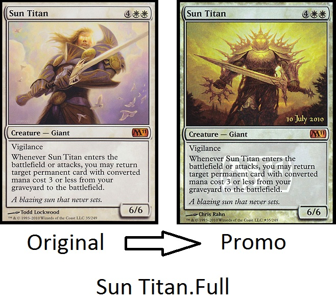

If you are using Windows 7, you can find the default location for the
Cockatrice card art files under
`C:\Program Files (x86)\Cockatrice\pics\downloadedPics` Once there, look
for the folder of the set for the card we are replacing. For this
example, Sun Titan is in the M11 folder. Open the folder and
paste/replace your new “Promo” Sun Titan.full[.JPG] into this folder,
discarding the original copy. (If you have not yet downloaded the
original image of a card by selecting it in the deck editor or playing
it in an online game, the card image will not yet be there)

Once you have the new card image in the proper folder, you can now start
Cockatrice (Or re-start if you already had the program open)and select
the deck editor to see your new card image.

If you are changing the art of a card that has multiple versions in
other sets, make sure you put the new card in whatever folder (or set)
is highest on your card database set list.

NOTE: Other players on Cockatrice will NOT see your new card image. They
will only see whatever version of the card is in their database.

Use Higher Resolution Cards
---------------------------

Can you get better/higher resolution card art than the default
downloaded card images already used?

Yes!

When you click on a card for the first time in the Deck Editor,
Cockatrice goes onto the internet and finds an image of that card from a
database on another website.

If you find a higher resolution .JPG of a card that you wish to use on
your Cockatrice, you can replace the image with no problem. If you can
find a card image in the 3,000 by 1,000 pixel range, and save it as the
cards (exact) name and add .Full to the end.

If you are using Windows 7, you can find the default location for the
Cockatrice card art files under
`C:\Program Files (x86)\Cockatrice\pics\downloadedPics`. Once there,
look for the folder of the set for the card you are replacing. (If you
are not running Cockatrice as an administrator, look in
`C:\Users\username\AppData\Local\VirtualStore\Program Files (x86)\Cockatrice\pics\downloadedPics`.)

Open the folder of the set with the card, and paste/replace the new
higher resolution .JPG image with the old low quality one.

This process is the same for changing cards to custom images.

NOTE: Other Cockatrice players will not see your higher resolution card
art, they will only see the image they have in their own database.

Booster drafts
--------------

Cockatrice does not support booster drafts, so players need to use an
external service for this.

Most people use <http://ccgdecks.com/> so it’s probably not a bad idea
to register an account there before joining a game in Cockatrice.

What is Legacy / Vintage / EDH?
-------------------------------

See <http://en.wikipedia.org/wiki/Magic:_The_Gathering_formats>.

Linking cards and URLs in the Cockatrice chat.
----------------------------------------------

The Cockatrice chat supports linking of cards and URLs by use of certain
tags around a word or phrase.

### How to link a card in the Cockatrice chat

To link a card in the Cockatrice chat, type out the full name of the
card, surrounded by the [card] and [/card] tags.

For example:

    [card]Black Lotus[/card]

### How to link a URL in the Cockatrice chat

To link a URL in the Cockatrice chat, type out the url, surrounded by
the [url] and [/url] tags.

For example:

    [url]http://www.cockatrice.de[/url]
    [url]cockatrice.de[/url]

Servatrice on CentOS 6
======================

[servatrice] This Howto from woogerworks.com will help you to run your
own Cockatrice server (called Servatrice). An installation script can be
downloaded at: <http://www.woogerworks.com/cockatrice/installatrice>

BEFORE CONTINUING, PLEASE UNDERSTAND THESE ARE THE VERY MOST BASIC
STEPS. THIS WILL NOT CONFIGURE SECURITY SETTINGS (YOU ARE RESPONSIBLE
FOR YOUR OWN SECURITY)! THIS WILL NOT CONNECT THE SERVER TO A DATABASE!
USE AT YOUR OWN RISK.

1.  Open a command shell and install the prerequisites

    1.  `yum -y groupinstall "development tools"`

    2.  `rpm -Uvh http://dl.fedoraproject.org/pub/epel/6/x86_64/epel-release-6-8.noarch.rpm`

    3.  `yum -y install qt-mysql qt-devel qt-mobility-devel protobuf-devel protobuf-compiler cmake28 libgcrypt-devel`

    4.  `cd`

2.  Download the source code:

    1.  `git clone https://github.com/Daenyth/Cockatrice`

    2.  `cd Cockatrice`

    3.  `mkdir build`

    4.  `cd build`

    5.  `cmake28 -DWITH_SERVER=1 ..`

    6.  `make`

    7.  `sudo make install`

3.  Create a servatrice.ini file. There is an example file you can
    convert:
    `sed -e "s/number_pools=1/number_pools=0/" ../servatrice/servatrice.ini.example > /servatrice.ini`
    Here is one example file:

        [server]
        port=4747
        statusupdate=15000
        logfile=server.log
        name="My own Cockatrice server"
        id=1
        number_pools=0

        [servernetwork]
        active=0
        port=14747
        ssl_cert=ssl_cert.pem
        ssl_key=ssl_key.pem

        [authentication]
        method=none

        [database]
        type=none
        prefix=cockatrice
        hostname=localhost
        database=servatrice
        user=MYUSERNAMEHERE
        password=MYSECUREPASSWORDHERE

        [rooms]
        method=config
        roomlist\size=1
        roomlist\1\name="FIRST ROOM NAME"
        roomlist\1\description="FIRST ROOM DESCRIPTION"
        roomlist\1\autojoin=true
        roomlist\1\joinmessage="THIS IS A JOIN MESSAGE"
        roomlist\1\game_types\size=11
        roomlist\1\game_types\1\name="Vintage (T1)"
        roomlist\1\game_types\2\name="Legacy (T1.5)"
        roomlist\1\game_types\3\name="Extended (T1.X)"
        roomlist\1\game_types\4\name="Modern"
        roomlist\1\game_types\5\name="Standard (T2)"
        roomlist\1\game_types\6\name="Block Constructed"
        roomlist\1\game_types\7\name="EDH/Commander"
        roomlist\1\game_types\8\name="Highlander"
        roomlist\1\game_types\9\name="2HG"
        roomlist\1\game_types\10\name="Draft/Sealed"
        roomlist\1\game_types\11\name="Other"

        [game]
        max_game_inactivity_time=120
        max_player_inactivity_time=15

        [security]
        max_users_per_address=8
        message_counting_interval=10
        max_message_size_per_interval=1000
        max_message_count_per_interval=10
        max_games_per_user=5

4.  Install the database server (optional)

    1.  `sudo yum -y install mysql-server mysql php-mysql`

    2.  `sudo service mysqld start`

    3.  `sudo chkconfig mysqld on`

    4.  `mysqladmin -u root password ’password’`

    5.  `mysql -u root -ppassword -e "create database servatrice;"`

    6.  `mysql -u root -ppassword -e "create user ’servatrice’@’localhost’ identified by ’password’;"`

    7.  `mysql -u root -ppassword -e "grant all privileges on servatrice.* to ’servatrice’@’localhost’;"`

    8.  `mysql -u servatrice -ppassword servatrice < ../servatrice/servatrice.sql`

    9.  `mysql -u servatrice -ppassword -e "insert into servatrice.cockatrice_users \ (admin,name,password_sha512,active) values (1,’servatrice’,’MYSHA512PASSWORD’,1);"`

    10. `sed -i.bak -e "s/password=foobar/password=password/" -e "s/type=none/type=mysql/" \ -e "s/method=none/method=sql/"  /servatrice.ini`

5.  Start Servatrice for testing: `/usr/local/bin/servatrice`. I
    recommend to run it later within a `screen` session or write an
    init-script.

You should be able to log in as a regular user using any account name.
You can login using the username *servatrice* and the password
*password* as the first moderator.

If everything succeeded, you should tweak the servatrice.ini and set
your root password to something strong if not already done (at least 8
characters, upper case, lower case, numbers, special characters).

[^1]: TODO, dead forum link

[^2]: TODO, dead forum link
