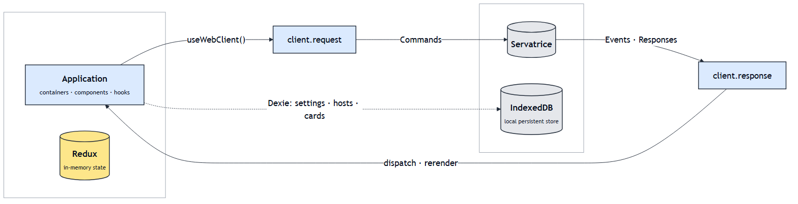
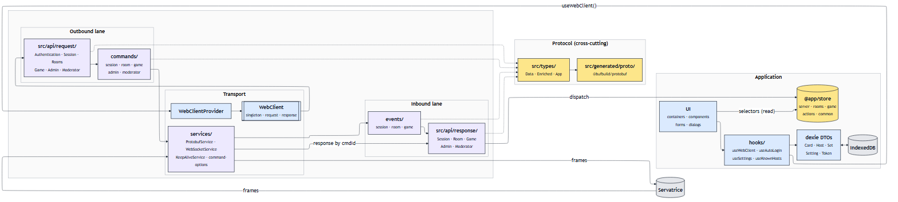
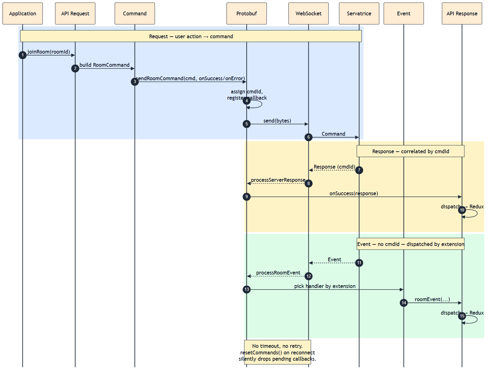

# Webatrice architecture diagrams

Three views of the same architecture at different zoom levels. The `.mmd` files are the source of truth — edit them and re-render when the architecture changes. The `.png` files are committed so the README and GitHub file view render everywhere, including offline.

For the prose counterpart and conventions, see [../.github/instructions/webclient.instructions.md](../../.github/instructions/webclient.instructions.md) (the canonical AI-tool instruction surface for this package).

## When to look at which

| Diagram | Use it when |
|---|---|
| **[simple](simple.mmd)** | You need a mental model of the request/response loop in ten seconds. Good for onboarding. |
| **[detailed](detailed.mmd)** | You're making a structural change and want to see every module, which layer it belongs to, and how data moves between them. |
| **[flow](flow.mmd)** | You're debugging a specific round-trip and need to see the runtime order. Shows the `cmdId`-correlated response path vs. the extension-dispatched event path, plus the "no timeout, no retry" caveat. |

## Simple — high-level flow



Application on the left, Servatrice on the right, two-lane racetrack in between. The top lane is outbound (`client.request.*` → `Commands`), the bottom lane is inbound (`Events · Responses` → `client.response.*`), and both lanes ride the same WebSocket. Redux hangs off Application as its in-memory store; IndexedDB sits under Servatrice as the browser-side persistent store reached from hooks via Dexie. Both are stores, both sit outside the racetrack.

**Color = role:**

- Blue — application code (UI, hooks, API seams, WebClient)
- Purple — transport (WebSocket layer, services)
- Amber — state / data stores (Redux, protocol types)
- Gray — external systems (Servatrice, IndexedDB)

## Detailed — layers & dependencies



Every meaningful module in the webclient, arranged as a three-lane racetrack: outbound (`src/api/request/` → `commands/`) on top, transport (`WebClientProvider` → `WebClient` → `services/`) in the middle, inbound (`events/` → `src/api/response/`) on the bottom. Application bookend on the left holds UI, hooks, Redux store, and the Dexie persistence pair; Servatrice sits on the right. The protocol satellite (`src/types/` + `src/generated/proto/`) is drawn below with dashed edges up to the modules it types — it's cross-cutting, not on the flow path. Same four-role palette as the simple diagram.

Load-bearing invariants (enforced on `webclient-websocket-layer`; keep it that way):

- **UI never imports `@app/websocket` or `@app/api`** — always go through `useWebClient()`.
- **Only `src/types/` imports from `@app/generated`** — everywhere else uses `Data` / `Enriched` / `App`.
- **Only `*.dispatch.ts` helpers and `*ResponseImpl` classes call `store.dispatch`** — the API response layer is the single inbound seam into Redux.

## Flow — command → response → event round-trip



Scenario: user joins a room. The sequence shows the outbound command path (steps 1–6), the correlated response path matched by `cmdId` in `ProtobufService`'s pending map (steps 7–10), and an unsolicited server event dispatched by proto-extension match against the event registry in `processRoomEvent` / `processSessionEvent` / `processGameEvent` (steps 11–15).

Read the footnote: `ProtobufService` has no timeout and no retry, and `resetCommands()` on reconnect silently drops in-flight callbacks. Code that needs reconnection resilience has to handle it at a higher layer.

## Rendering

npm scripts are defined in [../package.json](../package.json) — no separate build step, no added runtime dependency (everything runs via `npx`).

```bash
# from the webclient/ directory:

npm run diagram            # render all three (simple + detailed + flow)
npm run diagram:simple     # render just simple.png
npm run diagram:detailed   # render just detailed.png
npm run diagram:flow       # render just flow.png
```

Under the hood each command is:

```bash
npx -y -p @mermaid-js/mermaid-cli -p puppeteer mmdc \
    -i architecture/<name>.mmd -o architecture/<name>.png -b white -s 2
```

`-s 2` renders at 2× scale so the PNG stays crisp on high-DPI displays; `-b white` gives the diagrams a light-mode background that looks right in both GitHub's light and dark themes.

If `mmdc` fails locally (it spawns headless Chromium — some sandboxed environments block that), paste the `.mmd` contents into [mermaid.live](https://mermaid.live) and export to PNG. The `.mmd` sources remain canonical either way.
